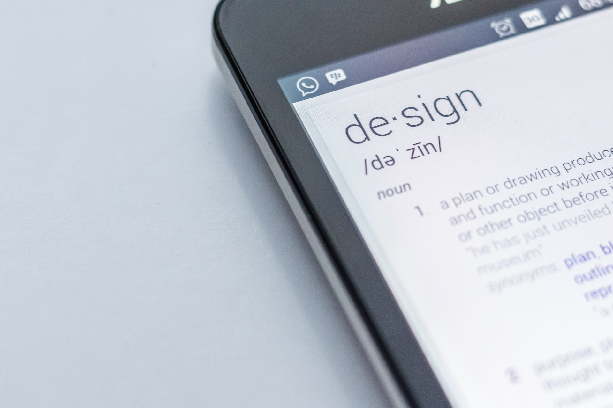

O design instrucional surgiu depois da Segunda Guerra Mundial para melhorar o treinamento milhares de pessoas no setor militar. Isso mostra que o design instrucional não é um conceito novo, muito menos um modismo. É uma disciplina rigorosa baseada em evidências. E todo processo tem um início.

**ADDIE** é um termo coloquial usado para descrever uma abordagem sistemática para o desenvolvimento instrucional. A Universidade da Flórida o desenvolveu para as Forças Armadas Americanas. Profissionais passaram a revisar as etapas e, eventualmente, o modelo tornou-se mais dinâmico e interativo do que a versão militar original. Durante os anos 80 ela finalmente se tornou a ferramentas que usamos hoje. 

Grande parte dos modelos de design instrucional atuais são derivados ou variantes do ADDIE. Quando tudo dá certo, assim como nas vendas, tudo parece apenas mágica. Porém, a compreensão de cada etapa e seu devido desenvolvimento garantem os sucessos dos projetos.

O desenvolvimento de experiências de aprendizagem é sofisticado e complexo. O ADDIE é dividido em etapas, e cada etapa tem um resultado que alimenta a etapa subseqüente, em cadeia:

1. Análise
2. Projeto
3. Desenvolvimento
4. Implementação
5. Avaliação 

## Fase de Análise

A fase de análise esclarece os problemas e objetivos instrucionais e identifica o ambiente de aprendizagem e os conhecimentos e habilidades existentes do aluno. 

O processo de fazer essas perguntas geralmente faz parte de uma análise de necessidades ainda mais ampla, portanto, é a fase mais propensa a ser apressada, malfeita e enganosa de todo o processo.

Lideranças normalmente suspeitam das análises na proporção dos problemas que revelam. Respostas e soluções para problemas errados são, também, erradas dentro do contexto. Por isso, o designer instrucional precisa conduzir muito bem a fase de análise.

Toda fase de análise aborda certos pontos em comum, por exemplo: 

- Quem são os alunos e quais são suas características? 
- Qual é o objetivo do projeto? 
- Que tipos de restrições de aprendizagem existem? 
- Quais são as opções de entrega? 
- Quais são as considerações pedagógicas? 
- Quais teorias da aprendizagem de adultos podemos aplicar no projeto? 
- Qual é o prazo para conclusão do projeto? 

A **análise de necessidades** começa com uma entrevista com os *stakeholders*. São as partes interessadas que decidem o objetivo do projeto e definem seus limites, condições e orçamento. A coleta de dados na fase de análise também fornece informações importantes e essenciais sobre o cenário encontrado pelo designer instrucional.

A análise de necessidades também é um processo  porque esclarecer problemas e objetivos é um desafio em si mesmo. O designer instrucional investiga cada questão em busca de respostas. Quanto mais claras e objetivas forem as respostas do questionamento, mais eficaz é a experiência de aprendizagem.

Normalmente o designer instrucional utiliza os elementos de circunstância (também conhecido como 5W) para começar sua análise, principalmente para analisar os problemas que a experiência de aprendizagem precisa resolver. 
O designer precisa responder a essas perguntas:

- Who was involved? (Quem estava envolvido?)
- What happened? (O que aconteceu?)
- Where did it take place? (Onde isso aconteceu?)
- When did it take place? (Quando isso aconteceu?)
- Why did that happen? (Por que isso aconteceu?)
- How did it happen? (Como isso aconteceu?)

Os elementos de circunstância é a abordagem básica para iniciar uma investigação, mas nunca é a única porque, embora útil, o 5W tem suas limitações. 

Por exemplo, a falta de apoio pode impedir o designer a dar a resposta certa às perguntas do tipo "por quê" e identificar a causa raiz dos problemas. Também impede o designer de ir além do seu conhecimento atual, portanto ele não consegue encontrar causas que ainda não conheça.

O designer instrucional também precisa analisar o público-alvo. Quem são? Quais são suas características? O que eles têm em comum? Qual a diferença entre eles? Quantos eles são? Onde eles estão? O que eles querem? O aluno sempre é o foco do processo de aprendizagem.

Por essa razão é importante contar com os **especialistas no assunto** (SME) nessa fase. Eles possuem a expertise na área onde a experiência de aprendizagem será aplicada - o designer instrucional precisa ser especialista em DI. A relação entre o especialista no assunto e o designer instrucional é delicada. Cada parte deve respeitar uns aos outros e seu campo de conhecimento!

O objetivo de qualquer oportunidade de aprendizado é ajudar o aluno a alcançar competências específicas em certos níveis de desempenho, e não transformar o aluno em outro especialista.

A fase de análise pode ser rápida ou muito complexa. Não existe uma fórmula certa para definir a sua duração - normalmente ela dura o tempo necessário para identificar as questões chaves ou pelo tempo que o orçamento da empresa permitir. Quanto melhor for a análise de necessidades, melhor será o desenvolvimento das próximas fases.

## Fase de Design 

A **fase de design** - ou desenho - cria a experiência de aprendizagem de acordo com o resultado da fase de análise. Aqui decidimos e definimos objetivos de aprendizado, métodos e atividades instrucionais (manuais, job aids, workshops, webinar, treinamentos, cursos eLearning, etc.), storyboards, conteúdo, conhecimento do assunto, esboços de lições e recursos de mídia.

Com as informações da fase de análise, agora o designer instrucional pensará em como resolver o desafio instrucional. Para isso ele deve pensar e responder uma série de questionamentos:

- É preciso um treinamento para atingir os objetivos?
- Esse treinamento deve ser on-line ou presencial?
- Aliás, seria o treinamento necessário de verdade ou é dispensável?
- Uma nova redação dos recursos já existentes na empresa, como manuais de operação ou processos, seria a resposta mais eficaz para o problema?
- Aliás, o problema pode ser resolvido com algum recurso de aprendizagem ou é uma característica da cultura organizacional da empresa?

Infelizmente, algumas pessoas têm apresentado a fase de design como **uma forma de projetar atividades com base no conteúdo** (ou no desejo) do cliente, pulando a fase de análise.

A fase de design deve ser sistemática e específica. Sistemático significa que o designer instrucional age segundo um método para tornar eficaz a experiência de aprendizagem necessária. Específico significa que o designer indicar com precisão o plano de design instrucional com instruções minuciosas e precisas para serem executadas na próxima fase.

Assim como na fase anterior, os especialistas no assunto (SME) continuam o trabalho junto com o designer instrucional. A atenção ao detalhe é imprescindível para desenhar a aprendizagem: o conhecimento do SME sobre sua área é o que permite o designer instrucional aplicar o próprio conhecimento no projeto.

## Fase de Desenvolvimento

A fase de desenvolvimento do modelo ADDIE é onde os designers instrucionais produzem o conteúdo e as interações de aprendizagem descritas na fase de design. Durante esta fase, o conteúdo é escrito e gráficos, áudio ou quaisquer outros meios também são criados e montados.

Na fase de desenvolvimento, o profissional especialista na produção de conteúdo irá criar esse material, seja ele qual for.

É bom saber que muita gente confunde o papel e função do designer instrucional com o de produtor de conteúdo. Há vários tipos de conteúdo, métodos e abordagens para usarmos numa experiência de aprendizagem. Cada um deles possui as suas particularidades e os seus profissionais - pessoas que atingiram seu nível de domínio através de extensas experiências.

Na fase de desenvolvimento, o profissional especialista na produção de conteúdo irá criar esse material, seja ele texto (copywriter), vídeo (videomaker), narrações (atores de voz), etc.

Algumas empresas acreditam que o papel do designer instrucional é criar o conteúdo que a empresa quer - e fazer o conteúdo ficar bonito e moderno para a implementação. Isso é simplesmente errado.

Vários designers instrucionais se especializaram na produção de conteúdo - por exemplo, usando ferramentas como o Articulate Storyline e Rise, entre outras. A pessoa certa para o desenvolvimento do conteúdo é um profissional especializado. Ele também pode ser um designer instrucional, ou não.

## Fase de Implementação

Durante a parte de implementação do modelo ADDIE, o designer instrucional entrega o conteúdo e os materiais para o Learning Management Systems (LMS), diretamente para o treinador para eventos de treinamento, ou o responsável pela implementação. 

O designer instrucional também fornece treinamento necessário para treinadores, facilitadores e/ou instrutores.
Assim como na fase de desenvolvimento, quem fará a implementação e como ela será realizada depende das soluções decididas pelo designer instrucional e a estrutura da empresa.

O importante é garantir que tudo que o aluno precise para aproveitar a experiência de aprendizagem esteja entregue e disponível para ele. 

## Fase de Avaliação

Durante a fase de avaliação do modelo ADDIE, o designer instrucional aplica o que será o sucesso da experiência de aprendizagem e como ele será medido. Muitas vezes, a avaliação consiste em duas fases: formativa e somativa. 
A avaliação formativa é realizada e repetida ao longo das fases de design e desenvolvimento. Ela ocorre durante todo o ADDIE. 

A avaliação somativa consiste em testes que são feitos - e/ou métricas que serão analisadas - depois da entrega da experiência de aprendizagem. 

Os resultados desses testes/métricas ajudam a esclarecer para o designer instrucional e stakeholders se o treinamento atingiu ou não seus objetivos originais, delineados na fase de análise.

## Em Resumo

O ADDIE é o modelo mais usado em projetos de design instrucional. Enquanto modelo, ele é a apresentação de forma esquemática, simplificada, de um processo de trabalho. 

Porém, durante sua aplicação, ele se transforma em um **framework**, isto é, um ferramenta entre um “modelo” e um “método” que é, ou contém, uma estrutura (não completamente detalhado) para o desenvolvimento de experiências de aprendizagem. O ADDIE permite muito mais liberdade em relação ao uso (parcial ou total) dos modelos ou técnicas nele contidos. Por isso ele é a base de diversos outros modelos usados no design instrucional.

Conhecê-lo muito bem permite ao designer instrucional criar e realizar experiências de aprendizagens eficazes, que permitam aos alunos conseguirem sucesso em suas jornadas e às empresas atingirem seus objetivos.

Imagens: Photo by <a href="https://unsplash.com/@edhoradic?utm_source=unsplash&utm_medium=referral&utm_content=creditCopyText">Edho Pratama</a>, <a href="https://unsplash.com/@brookelark?utm_source=unsplash&utm_medium=referral&utm_content=creditCopyText">Brooke Lark</a>, <a href="https://unsplash.com/es/@antenna?utm_source=unsplash&utm_medium=referral&utm_content=creditCopyText">Antenna</a>, <a href="https://unsplash.com/@kmuza?utm_source=unsplash&utm_medium=referral&utm_content=creditCopyText">Carlos Muza</a>, <a href="https://unsplash.com/@headwayio?utm_source=unsplash&utm_medium=referral&utm_content=creditCopyText">Headway</a> on <a href="https://unsplash.com/s/photos/big-data?utm_source=unsplash&utm_medium=referral&utm_content=creditCopyText">Unsplash</a>
  