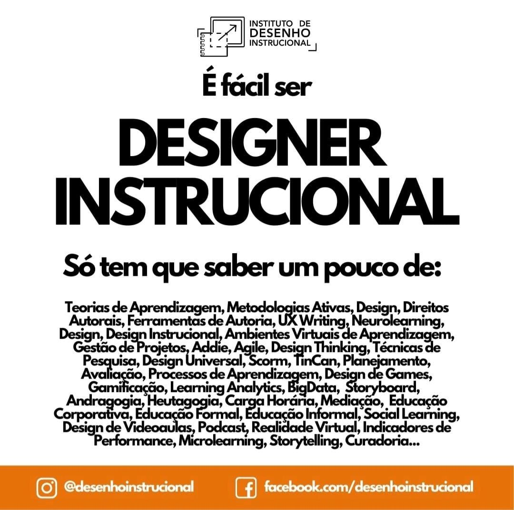

**Design Instrucional** (Instructional Design) combina a _arte_ de criar experiências de aprendizagem envolventes com a _ciência_ de como o cérebro funciona. É a criação de projetos e materiais de aprendizagem para garantir de forma eficaz a aquisição e a aplicação de conhecimentos e habilidades. E não é uma _novidade_.

A prática formal do _design instrucional_ surgiu da necessidade de treinar melhor os soldados após a Segunda Guerra Mundial: os militares precisavam uma forma de aprendizagem melhor para evitar que as pessoas explodissem os porta-aviões por “descuido”.

Nos anos seguintes à guerra, o psicólogo Robert Gagné projetou e testou materiais instrucionais para treinar os pilotos e as equipes da Força Aérea dos Estados Unidos.

Sua abordagem sistemática para analisar as necessidades de aprendizagem, para formular estratégias de ensino e para produzir materiais didáticos especializados permitiu a publicação de um artigo no início da década de 1960, apresentando os achados de sua pesquisa e formou a base de seu livro, “_The Conditions of Learning_”.

Desde então novos estudos na área de como a _aprendizagem acontece_ e na _forma como ela é implementada_ surgiram, criando um outro jeito de ensinar e aprender - mais eficaz e inteligente.



## Como o Design Instrucional é diferente dos treinamentos

Criar experiências eficazes de aprendizagem é complicado. Existem muitas práticas de aprendizagem amplamente implementadas que mais parecem _mitos_ ou _crendices_. Não surpreende que a maioria das experiências formais de aprendizagem sejam incrivelmente ineficientes.

Modelos de design instrucional fornecem estruturas para facilitar a obtenção de novos conhecimentos, habilidades ou atitudes. **Designers instrucionais** usam esses modelos para guiar a criação de atividades de aprendizagem não só envolventes, também baseadas na ciência de como as pessoas aprendem.

Por exemplo, uma diferença principal entre treinamentos e o _design instrucional_ é que, neste, há a necessidade de avaliação de efetividade – ou seja, testar materiais instrucionais com os alunos (e revisar de acordo com esses testes) - antes de dizer que o material está pronto para a implementação. 

Ao contrário dos treinamentos que desenvolvem o material com especialistas e apenas aplicam na equipe, no **design instrucional** você quer saber se o treinamento e o material são os melhores e indicados para atingir o resultado esperado antes de implementar a solução.

Ou seja, em um treinamento normal você só descobre se deu certo ou não quando você não tem mais o que fazer: no **final do processo.**

## O que faz um Designer Instrucional?

O **processo de design instrucional** consiste em determinar as necessidades dos participantes (alunos, empresa, ou seja, todos os _stakeholders_ no processo), definir as metas finais e objetivos da instrução, projetar e planejar tarefas de avaliação e projetar atividades de ensino e aprendizagem para garantir a qualidade da instrução.

O _designer instrucional_ sempre trabalha em equipe com ao menos um **Especialista no Assunto** (_Subject Matter Experts_).

Os **Especialistas em Assuntos** são pessoas que detém conhecimento de domínio, autoridade e credibilidade em uma especialidade ou área. Essas pessoas já podem até estar na sua empresa. Eles conhecem o trabalho por dentro e por fora. Geralmente possuem três atributos:

- **Anos de experiência** em um campo ou ocupação (a experiência de trabalho formal ou informal),
- **Informação para compartilhar**, que é comumente chamado de _conteúdo_ (uma maneira de fazer coisas que poderiam realmente ajudar os outros),
-  **Liderança** dentro de sua esfera de influência.

Embora alguns especialistas também sejam ótimos professores com um dom para educar, nem todos os especialistas sabem automaticamente a melhor maneira de transmitir sua _expertise_.

Eles sabem a melhor maneira de fazer o que fazem.

É aí que entra o **designer instrucional**. Ele trabalha com as SMEs para aprender o suficiente sobre o domínio e a expertise e criar um processo de aprendizagem eficaz, ajudando os especialistas a multiplicar sua influência.

## Modelos de design instrucional

Enquanto o ADDIE (Análise, Design, Desenvolvimento, Implementação, Avaliação) continua sendo um dos modelos de design instrucional mais utilizados, há uma série de outros modelos a considerar.

Nos últimos anos, as abordagens mais ágeis e interativas cresceram no mercado, incluindo o Modelo de Aproximação Sucessiva (SAM) de Michael Allen. Modelos ágeis, como o SAM, envolvem sprints de criação curtos, onde um protótipo é rapidamente criado, revisado e revisado, com o processo se repetindo até que as partes interessadas estejam satisfeitas.

Os modelos de design instrucional mais usados incluem:

-   [ADDIE](https://d4t.dev/post/addie-design-instrucional/)
-   Mapeamento de Ação de Cathy Moore
-   Modelo Dick e Carey
-   Modelo de design de Kemp
-   Princípios elementares de instrução de Merrill
-   SAM (Successive Approximation Model)
-   Agile ou prototipagem rápida

Nenhum modelo é melhor ou superior a outro. São ferramentas e, como ferramentas, você deve usar a ferramenta certa para o trabalho. O Designer Instrucional sabe identificar o melhor modelo para cada situação para desenvolver e implementar o processo de aprendizagem. 

## Como trabalhar com um Designer Instrucional

O designer instrucional pode trabalhar de duas formas:

A primeira é o **designer instrucional** como fornecedor de serviços para o cliente. Este é um arranjo comum para designers freelances ou empresas de design instrucional: eles recebem um trabalho de um cliente - normalmente um _especialista_ para desenvolver algo novo baseado em um conteúdo pré-existente. Esse é o modelo que usamos na [d4t.dev](https://d4t.dev).

Por exemplo, se um autor de livro de liderança entra em contato para construir um curso online sobre o tema sobre o qual ele fala com frequência, o _designer instrucional_ pesquisaria o conteúdo dele e forneceria um serviço de _design instrucional_ para esse cliente - desde uma consultoria para o desenvolvimento do projeto até, em alguns casos, desenvolver o projeto inteiro para ele.

A segunda é o **designer instrucional** como gerente de projeto para o _stakeholder_ de determinada área da empresa. Esse cenário é comum dentro de uma organização onde há um _designer instrucional_ que trabalha com equipes internas e externas para criar projetos de aprendizagem para essa empresa.

Exemplo, um _designer instrucional_ trabalhando dentro do departamento de RH e precisa montar treinamento de vendas para novos representantes. Ele não sabe tudo sobre vendas, é claro, mas ele trabalha para entrevistar e colaborar com gerentes de vendas e outras pessoas (os especialistas em assuntos) para construir uma ferramenta de aprendizagem que os ajude a receber os novos membros da equipe.

Como o aprendizado acontece em todos os lugares, não apenas em sala de aula, essas experiências podem assumir uma série de formas, desde treinamento convencional liderado por instrutores com manuais impressos, módulos interativos de e-learning e videogames, ou até mesmo simulações baseadas em cenários virtuais.

O _design instrucional_ utiliza a _visão sistêmica_ para desenvolver e implementar a melhor solução possível dentro de um orçamento para alcançar os resultados desejados pelo cliente.

## O impacto do Design Instrucional

Desenvolvimento da equipe é essencial para a competitividade de qualquer negócio. E quanto mais assertivo o processo de aprendizagem for, melhores resultados a empresa terá em relação ao investimento.

Se você está interessado em implementar uma transformação em sua empresa, ou apenas resolver lacunas de desempenho dentro de um grupo-alvo, considere aproveitar seus colaboradores especialistas e utilizar o _design instrucional_ nesse processo.