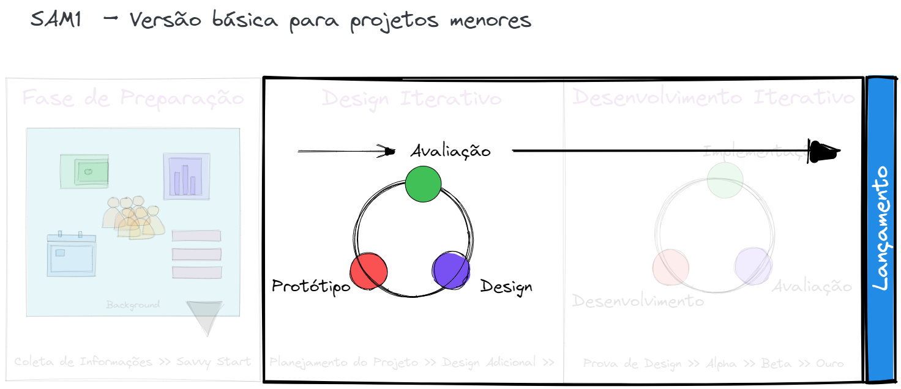
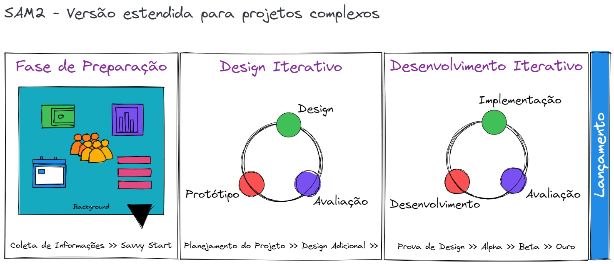

O Modelo de Aproximação Sucessiva (SAM) é uma versão simplificada do Modelo ADDIE, desenhado especificamente para obter feedback e construir modelos de trabalho desde o início do processo de design instrucional.

Desenvolvido pelo Dr. Michael Allen, este modelo usa um processo recursivo[^1] em vez do linear para o desenvolvimento da experiência de aprendizagem. 
[^1]:  que se pode repetir um número indefinido de vezes

O modelo SAM mais simples é composto de três partes: 
- Preparação, 
- Projeto Iterativo,
- Desenvolvimento Iterativo. 

A palavra-chave aqui é iterativo - feito de novo, repetido, reiterado - a base desse modelo. Cada etapa deve ser repetida e revisitada quantas vezes forem necessárias. Os seus resultados definem a próxima etapa que, ela mesma, pode ser repetida e revisitada.

## **SAM1** – Versão básica para projetos menores

O processo básico — chamado de SAM1 — é uma boa opção para projetos ou equipes menores. 

O SAM1 é um modelo simples com três iterações das etapas de design instrucional tradicional: análise, design e desenvolvimento. Usando essa abordagem, as ideias e suposições de todos podem ser discutidas, prototipadas e testadas já no início, aproximando-o de um produto utilizável mais rapidamente.

E se seu projeto for mais complexo? É aí que o SAM2 entra em jogo.

## **SAM2** – Versão estendida para projetos complexos

SAM2 é a versão estendida em SAM1. Consiste em oito etapas de design iterativo, espalhadas por três fases do projeto: Preparação, Design Iterativo e Desenvolvimento Iterativo.

- A **Fase de Preparação** consiste em dois passos para ajudá-lo a se preparar para o seu trabalho de design e desenvolvimento rapidamente: *coletar informações* e, em seguida, realizar uma reunião de *brainstorming e prototipagem* conhecida como "[Savvy Start](http://info.alleninteractions.com/iterative-design-in-action-implementing-the-savvy-start)" - sempre envolvendo o maior número possível de interessados ao desenvolver o material: colegas, orientadores e, se você tiver a sorte de tê-los como recurso, alunos.
- Na segunda, fase de **Design Iterativo** , o objetivo é projetar e desenvolver protótipos do material para ele ser avaliado pelas partes interessadas. A lógica aqui é ser mais fácil dar feedback e avaliar um produto que existe do que uma ideia de produto - permitindo a revisão e testes mais extensos.
- Na fase final de **Desenvolvimento Iterativo** , o protótipo finalizado é totalmente desenvolvido e implementado. Uma vez utilizado, pode ser avaliado e executado nas fases de desenvolvimento e implementação, se necessário.

## O que é melhor — ADDIE ou SAM?

Qual modelo de design é mais adequado para você e sua equipe?

Quando aplicada nas situações onde existe comprometimento de todos os envolvidos, a flexibilidade do SAM pode levá-lo a finalizar uma experiência de aprendizagem bem mais rápido. A abordagem iterativa ajuda você a usar protótipos para obter o *feedback* das partes interessadas rapidamente e facilita a mudança de seus requisitos de curso. 

No entanto, muitos designers instrucionais trabalham em organizações que adotaram a agilidade **na teoria, mas não tanto na prática**. Aplicar uma abordagem ágil como o SAM pode ser difícil quando seu ambiente não incentiva *feedback rápido* ou *processos flexíveis*. Nesses casos, o modelo tradicional do ADDIE pode ser uma escolha melhor.

Como o ADDIE é um método usado há décadas, os clientes, stakeholders (e até mesmo os membros da equipe) podem ficar mais confortáveis com sua previsibilidade e organização. Ainda que não seja tão flexível quanto o SAM, muitas pessoas aplicam uma versão adaptada do ADDIE que inclui alguns *loops iterativos* para aproveitar os pontos fortes de ambos os métodos.